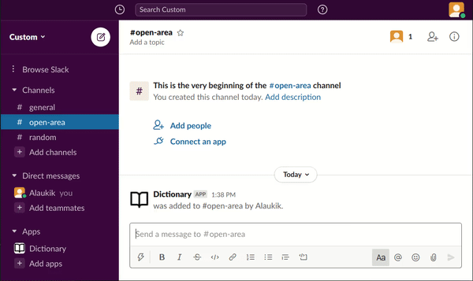
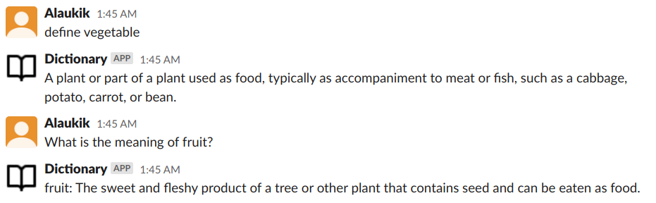

# dictionary-slackbot

> Dictionary bot runs as an addon on Slack and allows you to quickly look up the definition of any word. It also includes the ability to look up synonyms

## Live Demo

You need to have a Slack account. Use the link to join this workspace

https://join.slack.com/t/custom-nta2748/shared_invite/zt-iwxge1x1-cxdORB2HF~qh~2s~Re~7dQ

## Built With

- Ruby
- Slack-Ruby-Bot
- Unofficial googleDictionaryAPI
- Atom

### Prerequisites

- 'ruby'
- 'bundler'
- 'activesupport'
- 'async-websocket', '~>0.8.0'
- 'dotenv'
- 'httparty'
- 'json'
- 'puma'
- 'slack-ruby-bot'

### Usage

command 'define {word}'

- Tells you the definition of the specified {word}

Text 'What is the meaning of {word}?'

- Tells you the definition of the specified {word}'
- '?' (Question Mark) is required

command 'synonyms {word}'
- Lists the synonyms of the specified {word}

command 'Alternative words for {word}?'
- Lists the synonyms of the specified {word}
- '?' (Question Mark) is essential

command 'wordoftheday'
- Tells you the word of the day

command 'Word of the day' do
-  Tells you the word of the day

command 'Word of the day on {date}' do
-  Tells you the word of the day for the specified {date}

### Deployment

- Create a new workspace on Slack  (https://www.slack.com/create)
- Log in to the new workspace
- Create a bot on Slack website and add it to your workspace (https://slack.com/services/new/bot)
- Edit Configuration of the Bot and copy the API Token under the "Integration Settings"
- Clone the repository
- Create a .env file in root directory (It needs to be in the current working directory)
- Copy the Slack API Token and assign the token to a variable named "SLACK_API_TOKEN" in the .env file.
- Run 'bundle install' to install the dependencies (Bundler is a Prerequisite)
- Run 'ruby bin/main.rb' from the root directory of the repository on your local machine
- Use the bot in your Slack workplace

## Authors

👤 **Alaukik**

- Github: [@newhorizon-tech](https://github.com/newhorizon-tech)
- Twitter: [@techintosh3](https://twitter.com/techintosh3)

## 🤝 Contributing

Contributions, issues, and feature requests are welcome!

Feel free to check the [issues page](https://github.com/newhorizon-tech/dictionary-slackbot/issues).

## Show your support

Give a ⭐️ if you like this project!

## Acknowledgments

API - https://github.com/meetDeveloper/googleDictionaryAPI
